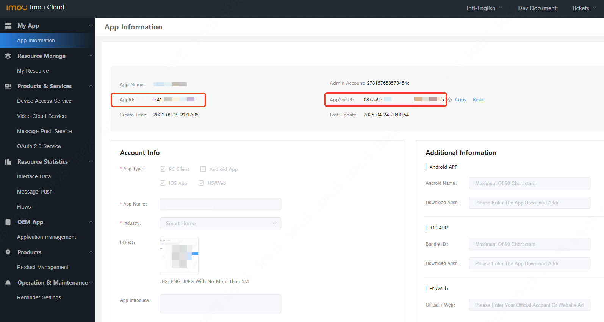
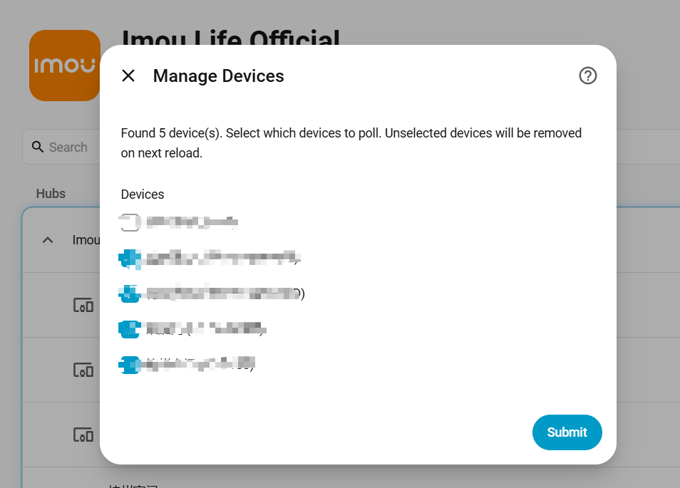
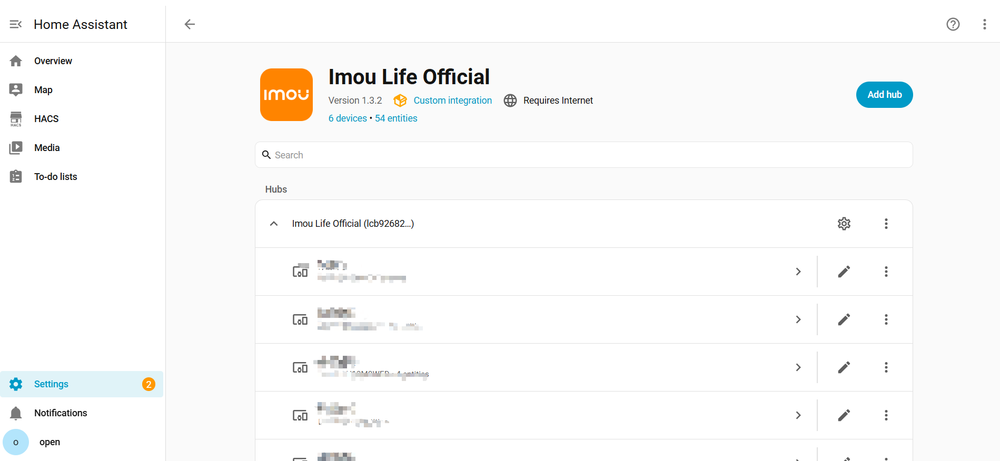
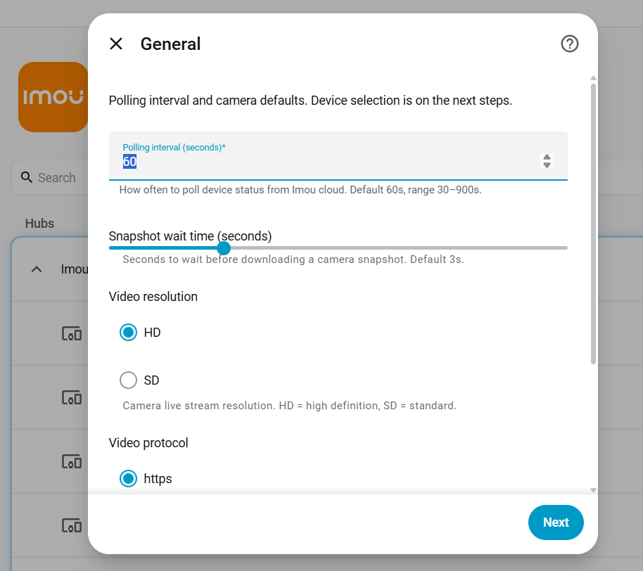
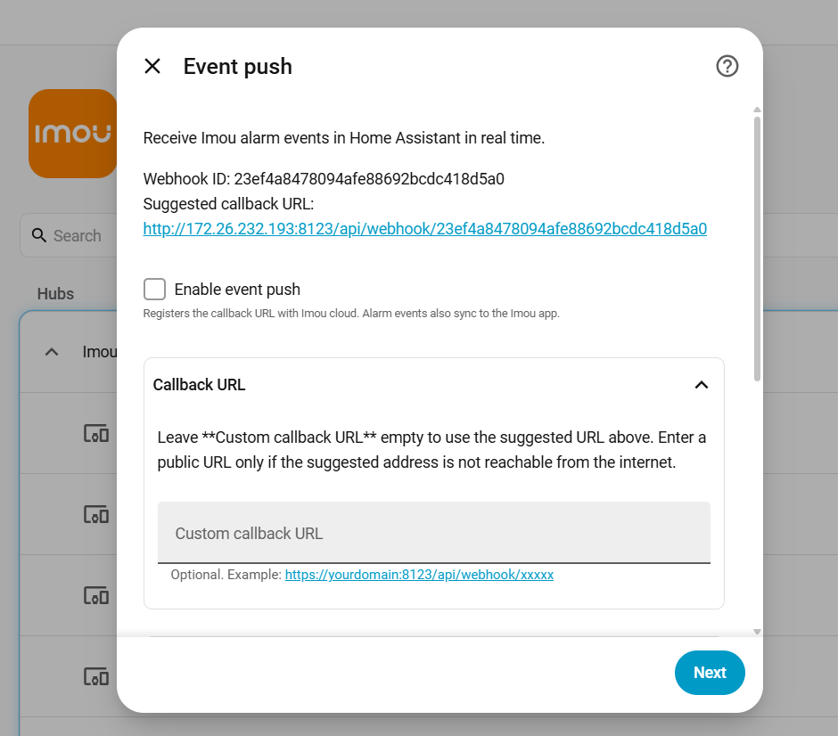

# Imou Life Home Assistant Integration

**[English](#english)** | **[简体中文](#zh-hans)**

[![HACS Default][hacs-badge]][hacs-url]
[![GitHub Release][release-badge]][release-url]
[![HACS Downloads][downloads-badge]][release-url]
[![Active Installs][installs-badge]][analytics-url]

## Introduction

This integration connects Home Assistant to Imou cameras and smart devices through the Imou Open Platform API: live video, device control, and status. You can extend it with automations and additional features.

> **Open Platform portal:** [open.imoulife.com](https://open.imoulife.com/) — China users, see [简体中文](#zh-hans).

## Installation

Register on the **international** Open Platform, then install via HACS.

### 1–2. Register & create AppId / AppSecret

| | |
| --- | --- |
| Portal | [open.imoulife.com](https://open.imoulife.com/) |
| Console | [My App](https://open.imoulife.com/consoleNew/myApp/appInfo) |
| Server region (HA login) | Singapore / Europe / North America (see [API domains](https://open.imoulife.com/book/http/develop.html)) |
| API domain doc | [develop.html](https://open.imoulife.com/book/http/develop.html) |
| My Resources | [Resource manage](https://open.imoulife.com/consoleNew/resourceManage/myResource) |

Register on [open.imoulife.com](https://open.imoulife.com/), then open **My App** in the console to create an application and obtain **AppId** and **AppSecret**.

### 3. Install via HACS

<b>Navigate to HACS, search for `Imou Life`, and install the integration.</b> On the login page, enter your App ID and App secret, and select the **server region** closest to your account (**Europe / North America / Singapore**). The region must match the international portal where the app was created.

Then select which devices to add. Unselected devices are not polled (saves API quota).

### 4. Done

Devices under your Imou account should appear in Home Assistant.

Use **Configure** on the integration entry to open a menu: **Polling and cameras**, **Alarms, notifications, and recording**, or **Choose and bind devices**. Each section saves when you submit that form; you do not need to visit the other sections in the same session.

- **Polling and cameras** — polling on/off and interval. Snapshot wait, live stream, and PTZ defaults are under **Camera defaults**.  

- **Alarms, notifications, and recording** — enable webhook callback, message types, alarm notifications, and local recording (shared save folder and clip duration for cameras whose **Record on alarm** switch is on). See [guides/local-event-recording.md](guides/local-event-recording.md#english).

Turn on **Enable event push**, then fill **Callback URL** (must be public; change hostname and port if the suggested address is not reachable) and **Subscribe to**.

- **Choose and bind devices** — choose which devices to poll, or **Bind a new device**; each action saves when you submit

>Note:  
>The integration uses the Imou Open Platform for cloud-based remote device access.  
>Cloud API calls and video playback consume the resource quota of your AppId account — check **My Resources** in the [international console](https://open.imoulife.com/consoleNew/resourceManage/myResource).

## Features
* **Integration & account**
  - Bind devices to your open-platform account from **Configure → Choose and bind devices** (device serial + binding code); setup no longer aborts when the account has no devices yet (bind now or finish with an empty selection)
  - Device selection at setup and in **Configure → Choose and bind devices** (poll only chosen devices)
  - **Configure** menu: **Polling and cameras**, **Alarms, notifications, and recording**, and **Choose and bind devices**; each section saves independently
  - Login aligned with Home Assistant Core: **server region** dropdown (Europe / North America / Singapore)
  - UI available in English and Simplified Chinese (follows Home Assistant language)
  - Built on [pyimouapi](https://pypi.org/project/pyimouapi/) 1.3.7 for Open Platform API access
* **Event push & automations**
  - Optional webhook callback for real-time messages from Imou cloud (requires public HA URL or manual callback URL)
  - **Configure → Alarms, notifications, and recording** — callback URL (suggested URL; replace hostname and port if it is not public), message types, phone notify, and local recording.
  - Home Assistant events: `imou_life_event` (all accepted pushes), `imou_life_alarm` (alarm-type only)
  - Optional alarm notifications: pick Companion App or other notify targets under **Configure → Alarms, notifications, and recording**. Silence one device with **Notify on alarm** on its device page (default on). Companion App: tap opens that camera/accessory's Home Assistant device page
  - Optional **Attach decrypted alarm thumbnail** (default off) adds a decrypted still to Companion App notifications when the push includes `picUrlArray`. **linux x86-64 only**; place the official Image Decryption Demo libraries in `/config/imou_life/native/` (`libLCOpenApiClient.so` and `libLCOpenSDK.so`). **TCM** devices need the Imou Life device password (sticker code or app password) under **Configure → Alarm image passwords** or **Default device password**. Your phone must reach Home Assistant's external URL for `/local/` images. Many motion pushes (`videoMotion`, `human`, …) have no `picUrlArray`; when absent, notifications stay text-only
  - Choose push message types; messages are also synced to the Imou Life app
  - Push payload alarm images are encrypted. Without the optional thumbnail, no snapshot is attached (Open API quota); use automations with `camera.snapshot` / `camera_proxy` if you need other notification images
  - **Record on alarm** — per-camera switch (default off, stored in Home Assistant only). When an alarm is pushed, the integration records a short cloud-HLS clip with `camera.record`. Shared folder and duration: **Configure → Alarms, notifications, and recording**. See [guides/local-event-recording.md](guides/local-event-recording.md#english)
* **Camera**
  - Status (name, online, storage, battery, …)
  - Live video
  - PTZ (direction buttons; duration in **Configure → Polling and cameras → Camera defaults**)
  - **Collection points** — `select.collection_point` (**Go to collection point**) lists points from the device / Imou Life app; choose one to move the camera (needs `CollectionPoint`; current position is not read back)
  - Detection: picture change, human, pet
  - Privacy mode, night vision, flip image, wide dynamic range, smart tracking
  - White light, alarm-linked white light, alarm-linked siren (configuration switches)
  - Manual siren via `siren` entity (`siren.turn_on` / `siren.turn_off`) on devices with Siren capability or IoT refs `25500`/`22200`; does not require event push for manual control. Entity state auto-clears after about 15 seconds (typical firmware hold), or immediately on a `sirenOff` push when event push is enabled
  - Audio recording, prompt sound, abnormal sound alarm
  - Restart device
* **Alarm sensors**
  - Status (name, online, battery, …)
  - Arming — `alarm_control_panel` (home / away / disarm)
  - Alarm volume
  - One-tap mute
  - Indicator light
  - Temperature and humidity
  - Restart device
* **Energy devices**
  - Status (name, energy use, online)
  - Plug switch and countdown
  - Plug indicator light
  - Max power

## Troubleshooting

- **Invalid App ID / App secret** — Home Assistant opens a **re-authentication** flow; enter a new App secret under **Settings → Devices & services → Imou Life** (notification or three-dot menu → **Re-authenticate**).
- **Event push not working** — Open **Configure → Alarms, notifications, and recording**. Confirm **Enable event push** is on. Paste the suggested URL into **Callback URL**, or change hostname and port if it is not public. Also check **Settings → System → Network → Home Assistant URL**. Review repair issues under **Settings → System → Repairs**.
  - Automations can listen to `imou_life_event` (all accepted pushes) and `imou_life_alarm` (security alarms only). Privacy-mask messages (`openCamera` / `closeCamera`) fire only `imou_life_event`.
  - If you receive `abAlarmSound` or `closeCamera`, the callback/webhook path is working.
  - If `videoMotion` / `human` / `mobileDetect` never appear: confirm picture change / human detection is enabled on the device; download **Diagnostics** and check `event_push.recent_msg_type_counts`. Missing keys mean the cloud/device did not push those types (not an HA misclassification). A push that does not match a Home Assistant device is discarded (still HTTP 200).
  - Confirm event push is enabled in **Configure** and push types include **alarm**.
- **Automations after upgrade** — v1.3.0 removes custom `imou_life.turn_on` / `turn_off` / `select` services; use standard `switch.turn_on`, `select.select_option`, and `button.press`. v1.3.6 replaces `select.select_option` on `select.*_mode` with `alarm_control_panel.alarm_arm_home` / `alarm_arm_away` / `alarm_disarm`, and `button.siren_start` / `siren_stop` with `siren.turn_on` / `siren.turn_off`.
- **PTZ collection points** — use `select.select_option` on `select.<device>_collection_point` with the collection point name (as shown in the Imou Life app). The select shows **Select a collection point…** when the camera is not at a known position.
- **Diagnostics** — Download redacted diagnostics from the integration's **Download diagnostics** (three-dot menu on the config entry).
- **Local recording / `camera.record`** — Stream not set up, path access errors, or unavailable camera entities: see [Local event recording](guides/local-event-recording.md#english).

## Contributing

Contributions are welcome. Please read [CONTRIBUTING.md](CONTRIBUTING.md) before opening a pull request.

- Development setup: `script/setup`
- Lint: `script/lint-check`
- Tests: `script/test`

## Statistics

| Metric | Source | Notes |
| --- | --- | --- |
| **Active installs** | [Home Assistant Analytics](https://analytics.home-assistant.io/custom_integrations.json) | Live HA instances reporting `imou_life` (opt-in analytics only) |
| **HACS downloads** | GitHub Releases | Total downloads of `imou_life.zip` (HACS install + update) |

---

## 简介

本集成通过 Imou 开放平台 API，把乐橙摄像头和智能设备接入 Home Assistant：直播、控制与状态查看，也可在此基础上做自动化和扩展。

> **开放平台入口：** [open.imou.com](https://open.imou.com/) — 海外用户请参阅 [English](#english)。

## 安装

在 **Imou 国内开放平台** 注册并创建应用，再通过 HACS 安装。

### 1–2. 注册并创建 AppId / AppSecret

| | |
| --- | --- |
| 平台入口 | [open.imou.com](https://open.imou.com/) |
| 控制台 | [我的应用](https://open.imou.com/consoleNew/myApp/appInfo) |
| 服务器区域（HA 登录） | **中国** |
| API 域名文档 | [develop.html](https://open.imou.com/book/http/develop.html) |
| 我的资源 | [资源管理](https://open.imou.com/consoleNew/resourceManage/myResource) |

在 [open.imou.com](https://open.imou.com/) 注册账号，进入控制台 **我的应用**，创建应用并获取 **AppId** 与 **AppSecret**。

### 3. 通过 HACS 安装

<b>在 HACS 中搜索 `Imou Life` 并安装集成。</b> 在登录页填写 App ID、App secret，服务器区域选择 **中国**（须与在 open.imou.com 创建应用时使用的区域一致）。

然后选择要添加的设备。未勾选的设备不会被轮询（可节省 API 配额）。

### 4. 完成

你的乐橙账号下的设备应已出现在 Home Assistant 中。

在集成条目上点击 **配置** 会打开菜单：**轮询与摄像头**、**告警、通知与录像** 或 **选择与绑定设备**。每一项提交即保存，同一次会话中无需进入其他分区。

- **轮询与摄像头** — 轮询开关与间隔。抓图等待、直播与云台默认参数在 **摄像头默认**。  

- **告警、通知与录像** — 启用 Webhook 回调、消息类型、告警通知，以及本地录像（账号共用保存目录和片段时长，只对打开了 **告警时录像** 开关的摄像头生效）。见 [guides/local-event-recording.md](guides/local-event-recording.md#zh-hans)。

先打开 **启用事件推送**，再填 **回调地址**（须公网可达；建议地址不可达时只改主机名和端口）和 **订阅类型**。

- **选择与绑定设备** — 勾选要轮询的设备，或 **绑定新设备**；每一步提交即保存

>说明： 
>本集成通过 Imou 开放平台进行云端远程访问。 
>云端 API 调用与视频播放会消耗 AppId 账号的资源配额 — 请在 [国内控制台](https://open.imou.com/consoleNew/resourceManage/myResource) 的 **我的资源** 中查看。

## 功能

* **集成与账号**
  - 在 **配置 → 选择与绑定设备** 中将设备绑定到开放平台账号（设备序列号 + 绑定码）；账号下尚无设备时安装流程不再中止（可立即绑定或暂不选择设备完成配置）
  - 安装时及 **配置 → 选择与绑定设备** 中可选择设备（仅轮询已选设备）
  - **配置** 菜单：**轮询与摄像头**、**告警、通知与录像**、**选择与绑定设备**；每一项可独立保存
  - 登录界面与 Home Assistant Core 对齐：**服务器区域** 选择 **中国**
  - 界面支持英文与简体中文（跟随 Home Assistant 语言设置）
  - 基于 [pyimouapi](https://pypi.org/project/pyimouapi/) 1.3.7 访问开放平台 API
* **事件推送与自动化**
  - 可选 Webhook 回调接收 Imou 云端实时消息（需公网可访问的 HA 地址或手动填写回调 URL）
  - **配置 → 告警、通知与录像** — 回调地址（建议地址；不可达时改主机名和端口）、消息类型、手机通知、本地录像。
  - Home Assistant 事件：`imou_life_event`（所有已接受推送）、`imou_life_alarm`（仅告警类）
  - 可选告警通知：在 **配置 → 告警、通知与录像** 中选择 Companion App 等通知目标；某台不想推可在设备页关掉 **告警时通知**（默认开）。Companion App：点通知打开该设备在 Home Assistant 中的设备页
  - 可选 **贴解密告警缩略图**（默认关）：推送含 `picUrlArray` 时，Companion App 通知可附带解密后的告警图。**仅 linux x86-64**；将官方 Image Decryption Demo 库放到 `/config/imou_life/native/`（`libLCOpenApiClient.so` 与 `libLCOpenSDK.so`）。**TCM** 设备需在 **配置 → 告警图片密码** 或 **默认设备密码** 中填写乐橙设备密码（机身贴纸码或 App 中设置的密码）。手机须能访问 Home Assistant 外网 URL 才能加载 `/local/` 图片。许多移动侦测推送（`videoMotion`、`human` 等）不含 `picUrlArray`；没有时通知仍为纯文本
  - 可选择推送消息类型；消息也会同步到乐橙 App
  - 推送载荷中的告警图片为加密格式。未开启可选缩略图时不附带抓图（避免占用开放平台额度）；若需其他通知图片，请在自动化中使用 `camera.snapshot` / `camera_proxy`
  - **告警时录像** — 每路镜头一个开关（默认关，只存在 Home Assistant）。收到告警推送后，用 `camera.record` 从云端 HLS 录一段短视频。保存目录和时长在 **配置 → 告警、通知与录像**。见 [guides/local-event-recording.md](guides/local-event-recording.md#zh-hans)
* **摄像头**
  - 状态（名称、在线、存储、电量等）
  - 直播
  - 云台（方向按钮；时长在 **配置 → 轮询与摄像头 → 摄像头默认** 中设置）
  - **收藏点** — `select.collection_point`（**转到收藏点**）列出设备 / 乐橙 App 中的收藏点，选择后跳转（需 `CollectionPoint`；无法读取当前是否在某一收藏点）
  - 检测：画面变化、人形、宠物
  - 隐私模式、夜视、画面翻转、宽动态、智能追踪
  - 白光灯、告警联动白光灯、告警联动警笛（配置区开关）
  - 具备 Siren 能力或 IoT refs `25500`/`22200` 的设备提供 `siren` 实体（`siren.turn_on` / `siren.turn_off`）；手动开关**不依赖**事件推送。实体状态约 15 秒后自动复位（与固件常见鸣响时长一致）；若已开事件推送，收到 `sirenOff` 会立即关
  - 音频录制、设备提示音、异常音告警
  - 重启设备
* **告警传感器**
  - 状态（名称、在线、电量等）
  - 布防 — `alarm_control_panel`（在家 / 离家 / 撤防）
  - 告警音量
  - 一键消音
  - 指示灯
  - 温湿度
  - 重启设备
* **能源设备**
  - 状态（名称、用电、在线）
  - 插座开关与倒计时
  - 插座指示灯
  - 最大功率

## 故障排查

- **App ID / App secret 无效** — Home Assistant 会打开**重新认证**流程；在 **设置 → 设备与服务 → Imou Life** 中输入新的 App secret（通知或三点菜单 → **重新认证**）。
- **事件推送不工作** — 打开 **配置 → 告警、通知与录像**。确认 **启用事件推送** 已开启。把建议地址填进 **回调地址**，或把主机名和端口改成公网可达的。同时检查 **设置 → 系统 → 网络 → Home Assistant URL**。在 **设置 → 系统 → 修复** 中查看 repair 提示。
  - 自动化可监听 `imou_life_event`（所有已接受推送）与 `imou_life_alarm`（仅安防告警）。隐私遮蔽消息（`openCamera` / `closeCamera`）仅触发 `imou_life_event`。
  - 若收到 `abAlarmSound` 或 `closeCamera`，说明回调/Webhook 路径正常。
  - 若始终收不到 `videoMotion` / `human` / `mobileDetect`：确认设备已开启画面变化/人形检测；下载**诊断**并查看 `event_push.recent_msg_type_counts`。缺少对应键表示云端/设备未推送该类型（非 HA 分类错误）。对不上 Home Assistant 设备的推送会被丢弃（仍返回 HTTP 200）。
  - 确认 **配置** 中已启用事件推送且推送类型包含 **alarm**。
- **升级后自动化** — v1.3.0 起移除自定义 `imou_life.turn_on` / `turn_off` / `select` 服务；请使用标准 `switch.turn_on`、`select.select_option`、`button.press`。v1.3.6 起 `select.*_mode` 的 `select.select_option` 改为 `alarm_control_panel.alarm_arm_home` / `alarm_arm_away` / `alarm_disarm`；`button.siren_start` / `siren_stop` 改为 `siren.turn_on` / `siren.turn_off`。
- **云台收藏点** — 对 `select.<设备>_collection_point` 使用 `select.select_option`，选项填乐橙 App 中的收藏点名称。当前位置未知时，下拉框显示 **选择收藏点…**。
- **诊断** — 在集成条目的三点菜单中 **下载诊断**（已脱敏）。
- **本地录像 / `camera.record`** — Stream 未启用、路径无权访问、相机实体 unavailable 等：见 [本地事件录像](guides/local-event-recording.md#zh-hans)。

## 贡献

欢迎贡献代码。提交 Pull Request 前请先阅读 [CONTRIBUTING.md](CONTRIBUTING.md)。

- 开发环境：`script/setup`
- 代码检查：`script/lint-check`
- 测试：`script/test`

## 统计

| 指标 | 来源 | 说明 |
| --- | --- | --- |
| **活跃安装量** | [Home Assistant Analytics](https://analytics.home-assistant.io/custom_integrations.json) | 上报 `imou_life` 的 HA 实例（仅参与统计的实例） |
| **HACS 下载量** | GitHub Releases | `imou_life.zip` 累计下载（HACS 安装与更新） |

<!-- Badge references -->
[hacs-badge]: https://img.shields.io/badge/HACS-Default-orange.svg?logo=HomeAssistantCommunityStore&logoColor=white&style=flat-square
[release-badge]: https://img.shields.io/github/v/release/Imou-OpenPlatform/Imou-Home-Assistant?style=flat-square&label=Release
[downloads-badge]: https://img.shields.io/github/downloads/Imou-OpenPlatform/Imou-Home-Assistant/total.svg?style=flat-square&label=HACS%20downloads
[installs-badge]: https://img.shields.io/badge/dynamic/json?color=41BDF5&logo=home-assistant&label=Active%20installs&suffix=%20installs&cacheSeconds=21600&url=https://analytics.home-assistant.io/custom_integrations.json&query=$.imou_life.total
[hacs-url]: https://github.com/hacs/integration
[release-url]: https://github.com/Imou-OpenPlatform/Imou-Home-Assistant/releases
[analytics-url]: https://analytics.home-assistant.io/custom_integrations.json
