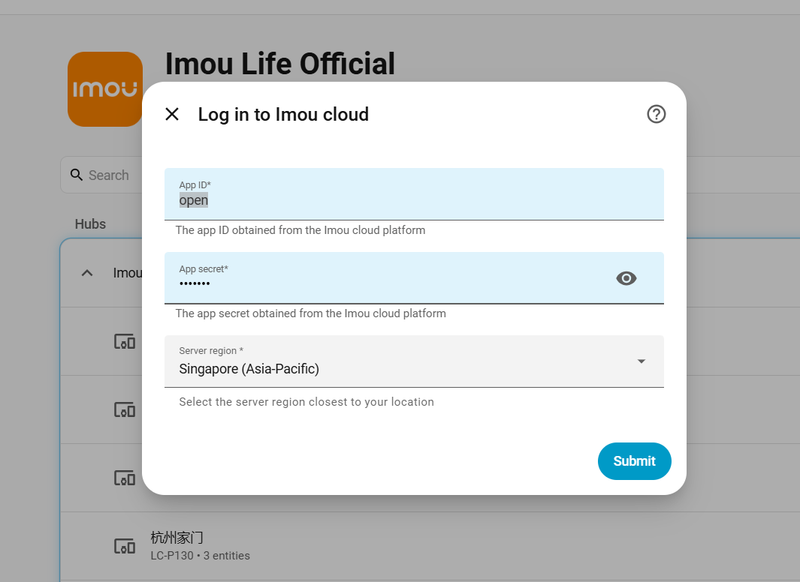

# Imou Home Assistant Component Integration

**English | [简体中文](README.zh-Hans.md)**

[![HACS Default][hacs-badge]][hacs-url]
[![GitHub Release][release-badge]][release-url]
[![HACS Downloads][downloads-badge]][release-url]
[![Active Installs][installs-badge]][analytics-url]

## Introduction

Imou Open Platform offers an open-source Imou python component. By integrating this component into the Home Assistant service, developers can access live preview, control devices, and view device statuses of Imou devices. Additionally, developers have the ability to extend the functionality of the Imou component by creating additional features.

This integration enables bidirectional communication between Home Assistant and Imou ecosystem devices via the Imou Open Platform API.

> **Open Platform portal:** [open.imoulife.com](https://open.imoulife.com/) — China users, see [简体中文](README.zh-Hans.md).

## Installation

Register on the **international** Open Platform, then install via HACS.

### 1–2. Register & create AppId / AppSecret

| | |
| --- | --- |
| Portal | [open.imoulife.com](https://open.imoulife.com/) |
| Console | [My App](https://open.imoulife.com/consoleNew/myApp/appInfo) |
| Server region (HA login) | Singapore / Europe / North America (see [API domains](https://open.imoulife.com/book/http/develop.html)) |
| API domain doc | [develop.html](https://open.imoulife.com/book/http/develop.html) |
| My Resources | [Resource manage](https://open.imoulife.com/consoleNew/resourceManage/myResource) |

Register on [open.imoulife.com](https://open.imoulife.com/), then open **My App** in the console to create an application and obtain **AppId** and **AppSecret**.

### 3. Install via HACS

<b>Navigate to HACS, search for `Imou Life`, and install the integration.</b> On the login page, enter your AppId and AppSecret, and select the **server region** closest to your account (**Europe / North America / Singapore**). The region must match the international portal where the app was created.

Then select which devices to add. Unselected devices are not polled (saves API quota).

### 4. Done

Devices under your Imou account should appear in Home Assistant.

Use **Configure** on the integration entry to adjust settings in three steps:

1. **General** — polling interval, snapshot wait time, live stream resolution/protocol, PTZ duration  

2. **Event push** — enable webhook callback, optional custom callback URL, message types, and alarm notifications  

On this step the integration shows your **Webhook ID** and a **suggested callback URL**. Leave **Custom callback URL** empty to use the suggested address; enter a public URL only if the suggested one is not reachable from the internet.

3. **Manage devices** — choose which devices to poll

>Note:  
>The integration uses the Imou Open Platform for cloud-based remote device access.  
>Cloud API calls and video playback consume the resource quota of your AppId account — check **My Resources** in the [international console](https://open.imoulife.com/consoleNew/resourceManage/myResource).

## Features
* **Integration & account**
  - Device selection at setup and in **Configure → Manage devices** (poll only chosen devices)
  - **Configure** wizard: **General** (polling, camera, PTZ) → **Event push** → **Manage devices**
  - Login aligned with Home Assistant Core: **server region** dropdown (Europe / North America / Singapore)
  - UI available in English and Simplified Chinese (follows Home Assistant language)
  - Built on [pyimouapi](https://pypi.org/project/pyimouapi/) 1.3.2 for Open Platform API access
* **Event push & automations**
  - Optional webhook callback for real-time messages from Imou cloud (requires public HA URL or manual callback URL)
  - **Configure → Event push** shows Webhook ID and suggested callback URL; grouped settings for callback, message types, and notifications
  - Home Assistant events: `imou_life_event` (all accepted pushes), `imou_life_alarm` (alarm-type only)
  - Optional notify services for alarm messages (standard HA actions, comma-separated)
  - Choose push message types; messages are also synced to the Imou mobile app
  - Alarm images in push payloads are encrypted — use automations with `camera.snapshot` / `camera_proxy` if you need notification thumbnails
* **Camera Function Management**
  - Information and status display (device name, online status, storage status, battery level, etc.)
  - Live video preview
  - PTZ control
  - Motion detection configuration
  - Human detection configuration
  - Privacy mode configuration
  - Night vision mode configuration
  - White light alarm configuration
  - Audio capture configuration
  - Abnormal sound alarm configuration
  - Device reboot
* **Alarm Sensor Smart Device Management**
  - Information and status display (device name, online status, arming mode, battery level, etc.)
  - Alarm volume configuration
  - One-click alarm mute
  - Indicator light switch configuration
  - Temperature & humidity monitoring
  - Device reboot
* **Energy Smart Device Management**
  - Information and status display (device name, power consumption, online status)
  - Socket switch and countdown settings
  - Socket indicator configuration
  - Socket power configuration

## Troubleshooting

- **Invalid AppId / AppSecret** — Home Assistant opens a **re-authentication** flow; enter a new App Secret under **Settings → Devices & services → Imou Life** (notification or three-dot menu → **Re-authenticate**).
- **Event push not working** — Open **Configure → Event push**. Confirm **Enable event push** is on; note the **Webhook ID** and **Suggested callback URL** at the top. Leave **Custom callback URL** empty unless you need a different public URL. Also check **Settings → System → Network → Home Assistant URL** (external URL required). Review repair issues under **Settings → System → Repairs**.
  - Automations can listen to `imou_life_event` (all accepted pushes) and `imou_life_alarm` (security alarms only). Privacy-mask messages (`openCamera` / `closeCamera`) fire only `imou_life_event`.
  - If you receive `abAlarmSound` or `closeCamera`, the callback/webhook path is working.
  - If `videoMotion` / `human` / `mobileDetect` never appear: confirm motion/human detection is enabled on the device; download **Diagnostics** and check `event_push.recent_msg_type_counts`. Missing keys mean the cloud/device did not push those types (not an HA misclassification).
  - Confirm event push is enabled in **Configure** and push types include **alarm**.
- **Automations after upgrade** — v1.3.0 removes custom `imou_life.turn_on` / `turn_off` / `select` services; use standard `switch.turn_on`, `select.select_option`, and `button.press`.
- **Diagnostics** — Download redacted diagnostics from the integration's **Download diagnostics** (three-dot menu on the config entry).

## Contributing

Contributions are welcome. Please read [CONTRIBUTING.md](CONTRIBUTING.md) before opening a pull request.

- Development setup: `script/setup`
- Lint: `script/lint-check`
- Tests: `script/test`

## Statistics

| Metric | Source | Notes |
| --- | --- | --- |
| **Active installs** | [Home Assistant Analytics](https://analytics.home-assistant.io/custom_integrations.json) | Live HA instances reporting `imou_life` (opt-in analytics only) |
| **HACS downloads** | GitHub Releases | Total downloads of `imou_life.zip` (HACS install + update) |

<!-- Badge references -->
[hacs-badge]: https://img.shields.io/badge/HACS-Default-orange.svg?logo=HomeAssistantCommunityStore&logoColor=white&style=flat-square
[release-badge]: https://img.shields.io/github/v/release/Imou-OpenPlatform/Imou-Home-Assistant?style=flat-square&label=Release
[downloads-badge]: https://img.shields.io/github/downloads/Imou-OpenPlatform/Imou-Home-Assistant/total.svg?style=flat-square&label=HACS%20downloads
[installs-badge]: https://img.shields.io/badge/dynamic/json?color=41BDF5&logo=home-assistant&label=Active%20installs&suffix=%20installs&cacheSeconds=21600&url=https://analytics.home-assistant.io/custom_integrations.json&query=$.imou_life.total
[hacs-url]: https://github.com/hacs/integration
[release-url]: https://github.com/Imou-OpenPlatform/Imou-Home-Assistant/releases
[analytics-url]: https://analytics.home-assistant.io/custom_integrations.json
